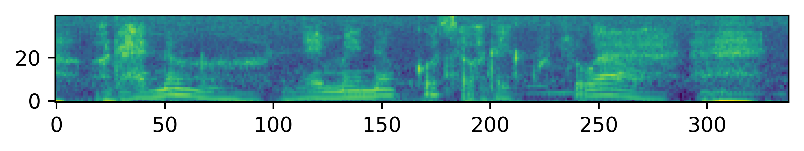
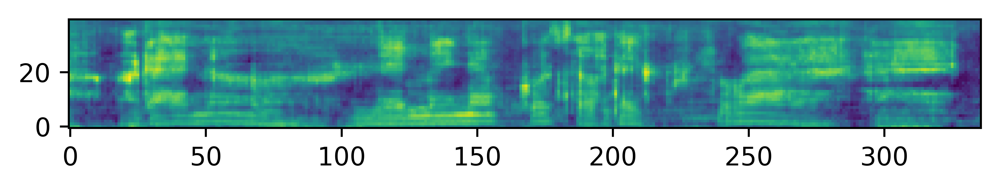

# Cycle-GAN-VC2
An implementation of [Kaneko+ 2019](http://www.kecl.ntt.co.jp/people/kaneko.takuhiro/projects/cyclegan-vc2/index.html)

## Requirements
Python >= 3.6.0  
PyTorch >= 1.0  
(If anything else, please give me an issue.)

## Recipe
```
echo Start training...
mkdir -p ${SAVE_DIR}
mkdir ${SAVE_DIR}/params
cp CycleGAN-VC2/hparams.py ${SAVE_DIR}
# If you cannot use GPU, please delete 'CUDA_VISIBLE_DEVICES=0' from the next line.
CUDA_VISIBLE_DEVICES=0 python train.py ${SOURCE_FEATURE_LIST} ${TARGET_FEATURE_LIST} ${SAVE_DIR}

echo Converting features...
mkdir ${SAVE_DIR}/feats
# If you cannot use GPU, please delete 'CUDA_VISIBLE_DEVICES=0' from the next line.
CUDA_VISIBLE_DEVICES=0 python FeatureConvertor.py ${SOURCE_FEATURE_LIST} ${SAVE_DIR}/params/step50000.net st ${SAVE_DIR}/feats
```

## A sample of conversion
Original


After 50000 steps

